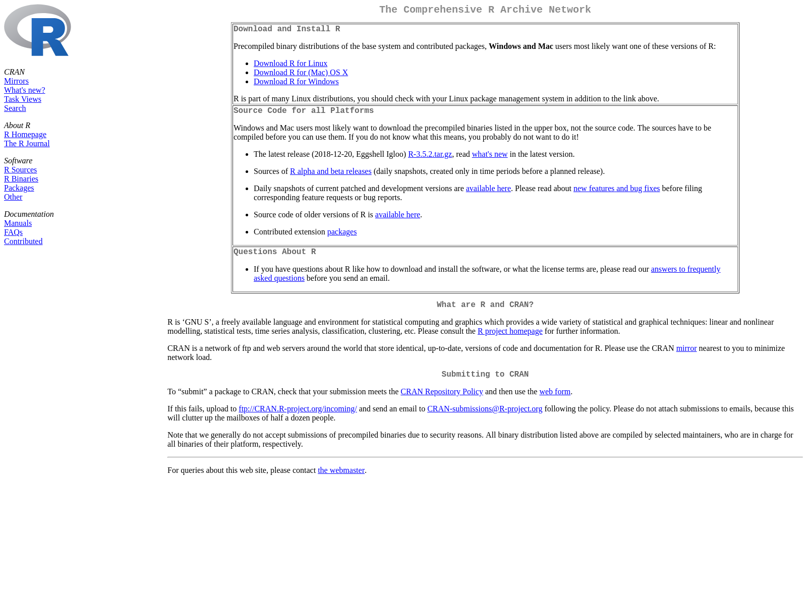

# urlscan

Analyze Websites and Resources They Request

## Description

WIP

The <urlscan.io> service provides an 'API' enabling analysis of 
websites and the resources they request. Much like the 'Inspector' of your 
browser, <urlscan.io> will let you take a look at the individual resources 
that are requested when a site is loaded. Tools are provided to search
public <urlscans.io> scan submissions.

## What's Inside The Tin

The following functions are implemented:

- `urlscan_search`: Perform a urlscan.io query

## Installation

```{r eval=FALSE}
devtools::install_github("hrbrmstr/urlscan")
```

```{r message=FALSE, warning=FALSE, error=FALSE, include=FALSE}
options(width=120)
```

## Usage

```{r message=FALSE, warning=FALSE, error=FALSE}
library(urlscan)

# current verison
packageVersion("urlscan")
```

```{r}
library(tidyverse)

x <- urlscan_search("domain:r-project.org")

bind_cols(
  select(x$results$task, -options) %>% 
    mutate(user_agent = x$results$task$options$useragent)
  ,x$results$stats, 
  x$results$page
) %>% 
  mutate(id = x$results$`_id`) %>% 
  mutate(result_api_url = x$results$result) %>% 
  tbl_df() -> xdf

xdf

glimpse(xdf)

ures <- urlscan_result(xdf$id[2], TRUE, TRUE)

str(ures$scan_result, 2)

magick::image_write(ures$screenshot, "img/shot.png")
```

