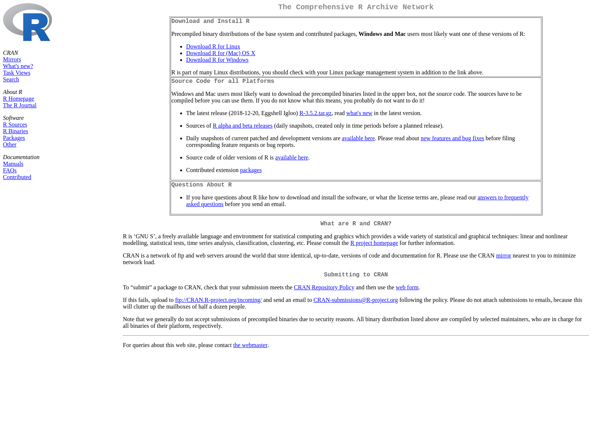

[](https://travis-ci.org/hrbrmstr/urlscan)
[](https://codecov.io/gh/hrbrmstr/urlscan)
[](https://cran.r-project.org/package=urlscan)

# urlscan

Analyze Websites and Resources They Request

## Description

The \<urlscan.io\> service provides an ‘API’ enabling analysis of
websites and the resources they request. Much like the ‘Inspector’ of
your browser, \<urlscan.io\> will let you take a look at the individual
resources that are requested when a site is loaded. Tools are provided
to search public \<urlscans.io\> scan submissions/results and submit
URLs for scanning.

## What’s Inside The Tin

The following functions are implemented:

  - `urlscan_search`: Perform a urlscan.io query
  - `urlscan_result`: Retrieve detailed results for a given scan ID
  - `urlscan_submit`: Submit a URL for scanning

## Installation

``` r
devtools::install_git("https://git.sr.ht/~hrbrmstr/urlscan")
# or
devtools::install_gitlab("hrbrmstr/urlscan")
# or
devtools::install_github("hrbrmstr/urlscan")
```

## Usage

``` r
library(urlscan)
library(tidyverse) # for demos

# current verison
packageVersion("urlscan")
```

    ## [1] '0.2.0'

``` r
x <- urlscan_search("domain:r-project.org")

as_tibble(x$results$task) %>% 
  bind_cols(as_tibble(x$results$page)) %>% 
  mutate(
    time = anytime::anytime(time),
    id = x$results$`_id`
  ) %>%
  arrange(desc(time)) %>% 
  select(url, country, server, ip, id) -> xdf

ures <- urlscan_result(xdf$id[2], include_dom = TRUE, include_shot = TRUE)

ures
```

    ##             URL: https://cran.r-project.org/
    ##         Scan ID: cdc2b957-548c-447a-a1b2-bebd6a734aec
    ##       Malicious: FALSE
    ##      Ad Blocked: FALSE
    ##     Total Links: 0
    ## Secure Requests: 9
    ##    Secure Req %: 100%

``` r
magick::image_write(ures$screenshot, "img/shot.png")
```



## urlscan Metrics

| Lang | \# Files |  (%) | LoC |  (%) | Blank lines |  (%) | \# Lines |  (%) |
| :--- | -------: | ---: | --: | ---: | ----------: | ---: | -------: | ---: |
| R    |       10 | 0.91 | 157 | 0.89 |          51 | 0.69 |      130 | 0.76 |
| Rmd  |        1 | 0.09 |  20 | 0.11 |          23 | 0.31 |       40 | 0.24 |

## Code of Conduct

Please note that the ‘urlscan’ project is released with a [Contributor
Code of Conduct](CODE_OF_CONDUCT.md). By contributing to this project,
you agree to abide by its terms.
